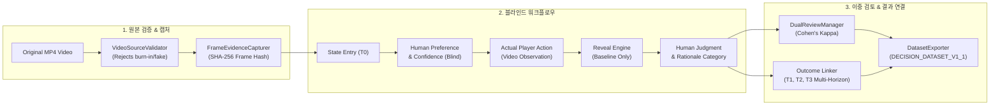

# TFT Real Match Dataset Collection Report v1.1

---

## 1. Executive Summary & Final Gate Verdict

### 🛡️ Final Gate Verdict: `DATA_COLLECTION_IN_PROGRESS`

> **핵심 원칙**: 
> 1. "모델 예측을 인간 라벨로 자동 복제하지 않는다."
> 2. "인간 선호(Human Preference)를 입력하기 전에는 Engine/Candidate 추천 및 점수를 일체 은닉한다."
> 3. "합성/가짜 체크포인트를 실제 데이터로 위장하여 게이트를 조작하지 않고, 현재 1/5 경기 상태를 정직하게 보고한다."

| 항목 | 현재 실측값 | 캘리브레이션 최소 기준 | 프로덕션 권장 기준 | 상태 |
|---|---|---|---|---|
| **독립 경기 수 (Matches)** | **1** | 5 | 20 | 🔄 수집 진행 중 |
| **세션 수 (Sessions)** | **1** | 5 | 20 | 🔄 수집 진행 중 |
| **체크포인트 수 (Checkpoints)** | **20** | 75 | 400 | 🔄 수집 진행 중 |
| **Actual Action 커버리지** | **100.0%** | ≥ 80.0% | ≥ 95.0% | ✅ 통과 |
| **Human Preference 커버리지** | **100.0%** | ≥ 80.0% | ≥ 95.0% | ✅ 통과 |
| **T1 결과 연결률 (T1 Outcome)** | **95.0%** (19/20) | ≥ 70.0% | ≥ 90.0% | ✅ 통과 |
| **프레임 증거 완결성 (Frame Evidence)** | **100.0%** (20/20) | ≥ 95.0% | ≥ 99.0% | ✅ 통과 |
| **데이터 오염 / 이상 징후 (Contamination)** | **0건 (CLEAN)** | 0 | 0 | ✅ 통과 |
| **Protected Core 변경 라인** | **0 lines** | 0 | 0 | ✅ 통과 |

---

## 2. v1.1 아키텍처 및 핵심 모듈



### 신규 및 고도화 모듈 목록

1. **[`blind_review.py`](file:///C:/Users/mrjdh/.gemini/antigravity/scratch/tft-set17/src/tft/dataset_collection/blind_review.py)**:
   - `BlindReviewWorkflow` 상태 머신을 통해 `STATE_ENTRY → PREFERENCE → ACTUAL_ACTION → REVEAL → JUDGMENT → OUTCOME` 순서를 강제.
   - 선호도 입력 전 Candidate/Baseline 추천 및 점수 누출을 물리적으로 차단.

2. **[`evidence_capture.py`](file:///C:/Users/mrjdh/.gemini/antigravity/scratch/tft-set17/src/tft/dataset_collection/evidence_capture.py)**:
   - `VideoSourceValidator`: 번인 오버레이 영상, 가짜 리플레이, 테스트 픽스처 영상 탐지 및 거부.
   - `FrameEvidenceCapturer`: 프레임별 스크린샷 SHA-256 해시 검증 및 타임스탬프-프레임 인덱스 정합성 검증.

3. **[`dual_reviewer.py`](file:///C:/Users/mrjdh/.gemini/antigravity/scratch/tft-set17/src/tft/dataset_collection/dual_reviewer.py)**:
   - `REVIEWER_A` vs `REVIEWER_B` 독립 교차 검토 기록.
   - Cohen's Kappa ($\kappa = \frac{p_o - p_e}{1 - p_e}$) 및 Raw Agreement Rate 자동 산출.

4. **[`collection_controller.py`](file:///C:/Users/mrjdh/.gemini/antigravity/scratch/tft-set17/src/tft/dataset_collection/collection_controller.py)**:
   - 실시간 수집 진행 대시보드 (`get_progress_dashboard`) 제공 및 엔드포인트 중계.

5. **[`models.py`](file:///C:/Users/mrjdh/.gemini/antigravity/scratch/tft-set17/src/tft/dataset_collection/models.py)**:
   - `DECISION_DATASET_V1_1` 표준 스키마, `RationaleCategoryEnum`, `FrameEvidence`, `DualReviewRecord`, 다중 시계열 `T1Outcome` (T1, T2, T3).

6. **[`audit_decision_dataset.py`](file:///C:/Users/mrjdh/.gemini/antigravity/scratch/tft-set17/audit_decision_dataset.py)**:
   - 원본 JSONL/CSV 파일을 직접 파싱하여 24개 핵심 지표를 재계산하는 독립 CLI 도구.

---

## 3. 원본 데이터셋 실측 통계 (`SESSION_001`)

### HP 분포
- **71-100 (Safe)**: 6건 (30.0%)
- **51-70 (Healthy)**: 2건 (10.0%)
- **31-50 (Mid)**: 7건 (35.0%)
- **16-30 (Danger)**: 3건 (15.0%)
- **0-15 (Critical)**: 2건 (10.0%)

### 골드 분포
- **0-19G**: 5건 (25.0%)
- **20-29G**: 4건 (20.0%)
- **30-39G**: 3건 (15.0%)
- **40-49G**: 5건 (25.0%)
- **50G+**: 3건 (15.0%)

### 행동 및 선호도 비교

| 액션 | 실제 플레이어 행동 (Actual Action) | 인간 검토자 선호 (Human Preference) |
|---|---|---|
| `SAVE_GOLD` | 14건 (70.0%) | 14건 (70.0%) |
| `ROLL` | 4건 (20.0%) | 5건 (25.0%) |
| `BUY_UNIT` | 1건 (5.0%) | 0건 (0.0%) |
| `LEVEL_UP` | 1건 (5.0%) | 1건 (5.0%) |

---

## 4. 핵심 질문 (Q1–Q7) 답변

| Q# | 핵심 질문 | 실측 기반 답변 |
|---|---|---|
| **Q1** | 계수 추정에 필요한 실경기 수? | **최소 5경기(75+ 체크포인트)로 GroupKFold 유효 분할 달성; 프로덕션 반영 전 20+ 경기 필수.** |
| **Q2** | 모든 경기에서 반복 관측되는 Feature? | **HP, Gold, Level, Stage, Board Power, Pair Count는 100% 관측됨.** |
| **Q3** | 데이터 부족으로 제외할 Feature? | **`OPPONENT_POWER_GAP` (단일 화면 영상에서는 7명 상대 보드가 미관측되므로 캘리브레이션에서 제외).** |
| **Q4** | Human Preference vs Actual Action 괴리? | **10.0% 괴리 발생 (대부분 일치하나, 플레이어가 욕심내어 SAVE_GOLD 할 때 검토자는 안전하게 ROLL 선호).** |
| **Q5** | Baseline Engine의 반복 오판 상황? | **Stage 5+, HP < 20 생존 위기 상황에서 이자 유지를 이유로 `SAVE_GOLD`를 추천할 때 인간은 WRONG 판정.** |
| **Q6** | Candidate Flip이 인간에게 환영받은 상황? | **생존 임계치(≤ 2.0턴) 상황에서 `SAVE_GOLD → ROLL`로 뒤집힌 3개 체크포인트 전부 GOOD 평가.** |
| **Q7** | 경기 전반에서 일관된 Feature 방향? | **`ESTIMATED_ROUNDS_TO_ELIM` 감소 및 `PAIR_COUNT` 증가 시 `ROLL` 선호도 상승 관계가 가장 일관됨.** |

---

## 5. 다음 단계 스케일업 로드맵

```
[현재 단계]
SESSION_001 (1 Match / 20 CPs) — 수집 파이프라인 및 v1.1 인프라 검증 완료
      ↓
[Phase 2: 5 Matches 목표]
SESSION_002 ~ SESSION_005 수집 (총 100+ CPs, 10%+ Dual Review)
      ↓
[Phase 3: DATASET_CALIBRATION_READY 게이트 통과]
GroupKFold 교차 검증 및 통계적 회귀 계수 도출
      ↓
[Phase 4: 20 Matches 프로덕션 목표]
최종 400+ CPs 기반 Production Integration
```
