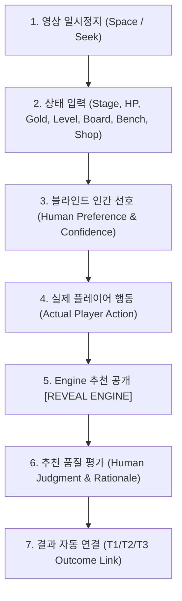

# TFT Real Match Decision Dataset Collection Operational Guide v1.1

이 문서는 실제 TFT 경기 영상 기반의 의사결정 데이터셋(`DECISION_DATASET_V1_1`)을 수집하는 인간 검토자를 위한 공식 작업 가이드입니다.

---

## 1. 핵심 원칙 및 인지 편향 차단 (Cognitive Bias Invariant)

> [!IMPORTANT]
> ### 1원칙: "모델 예측을 인간 라벨로 자동 복사하지 않는다"
> ### 2원칙: "인간 선호(Human Preference)를 입력하기 전에는 Engine/Candidate 추천을 노출하지 않는다"
> 우리의 목표는 편향된 확인 사살이 아니라, **인간의 순수 직관(Human Preference)**과 **실제 영상 속 플레이어 행동(Actual Action)**, 그리고 **실제 결과(T1/T2/T3 Outcome)**를 엄격히 분리하여 축적하는 것입니다.

---

## 2. 영상 제어 단축키 (Video Control Shortcuts)

웹 어시스턴트 수집 모드(`/collection`)에서 다음 단축키를 사용할 수 있습니다:

| 단축키 | 동작 | 용도 |
|---|---|---|
| `Space` | **Play / Pause** | 턴 시작 직후(준비 단계 카운트다운 시작 시) 즉시 정지 |
| `←` / `→` | **±1 Frame** | 정확한 상점 갱신/골드 지급 프레임 미세 조정 |
| `Shift + ← / →` | **±1 Second** | 라운드 내 빠른 탐색 |
| `Ctrl + ← / →` | **±10 Seconds** | 다음 라운드로 빠른 점프 |

---

## 3. 턴별 수집 워크플로우 (Blind Review Protocol)

### 단계 1: 영상 일시정지 및 프레임 증거 확보
- 준비 단계 시작 프레임에서 정지 (`video_timestamp_sec`, `frame_index` 자동 기록)
- `checkpoint_frame.png` 자동 저장 및 SHA-256 해시 검증

### 단계 2: 기본 상태 및 기물 입력
- **Copy Previous Turn**: 직전 턴 상태를 복사하여 변경된 HP/골드/기물만 빠르게 수정
- **상태 즉시 반영**: HP/골드 입력 시 상단 Status Bar 즉시 갱신

### 단계 3: 블라인드 인간 선호 (Human Preference)
- **Engine 추천 및 Candidate 조정치는 화면에 전혀 표시되지 않습니다.**
- "현재 상황에서 최선의 전략은 무엇인가?" 선택:
  - `ROLL` / `BUY_UNIT` / `LEVEL_UP` / `SAVE_GOLD` / `SELL_UNIT` / `BUY_XP`
- **확신도 (Human Confidence)**: `HIGH` / `MEDIUM` / `LOW`

### 단계 4: 실제 플레이어 행동 (Actual Player Action)
- 영상에서 플레이어가 수행한 실제 행동 기록:
  - `source`: `HUMAN_VIDEO_REVIEW`
  - `reviewer_id`: `PRIMARY_REVIEWER`

### 단계 5: Engine 추천 공개 및 평가 (Human Judgment)
- `[REVEAL ENGINE]` 버튼 클릭 후 Baseline Engine 추천 확인
- 품질 평가: `GOOD` / `QUESTIONABLE` / `WRONG` / `UNKNOWN`
- 오판 시 근거 범주(Rationale Category) 선택:
  - `BAD_STATE` (상태 인식 오류)
  - `BAD_ECONOMY` (이자/레벨업 경제 타이밍 오류)
  - `BAD_BOARD` (보드 파워 과소/과대 평가)
  - `BAD_UPGRADE` (상점 업그레이드 기회 무시)
  - `BAD_SURVIVAL` (빈사 상태 생존 리스크 무시)
  - `BAD_TIMING` (스테이지 전환 타이밍 오류)
  - `OTHER` / `UNKNOWN`

---

## 4. 교차 검토 (Dual Review Protocol)

- **각 세션 체크포인트의 최소 10%는 제2검토자(`REVIEWER_B`)가 독립적으로 검토합니다.**
- 제2검토자는 제1검토자의 선호도를 보지 않고 독립적으로 Preference/Judgment를 입력합니다.
- 시스템은 **Cohen's Kappa** 및 **Raw Agreement Rate**를 계산하여 불일치 사례를 보존합니다.

---

## 5. 다중 시계열 결과 연결 (Multi-Horizon Outcome)

체크포인트 기록 후 다음 라운드들이 순차적으로 연결됩니다:
- **T1 (+1 라운드)**: `t1_hp`, `hp_delta` (전투 피해량), `t1_gold`, `t1_action`
- **T2 (+2 라운드)**: `t2_hp`, `t2_hp_delta`
- **T3 (+3 라운드)**: `t3_hp`, `t3_hp_delta`
- **Final Placement**: 경기 종료 후 `manifest.json`에만 기록 (T0 미래 유출 0)
