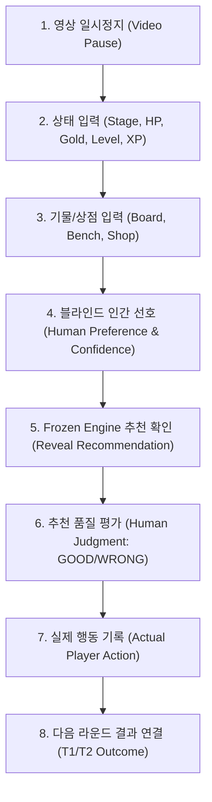

# TFT Real Match Decision Dataset Collection Operational Guide v1

이 문서는 실제 TFT 경기 영상 기반의 의사결정 데이터셋(`DECISION_DATASET_V1`)을 수집하는 인간 검토자를 위한 공식 작업 가이드입니다.

---

## 1. 데이터 수집의 목적과 핵심 원칙

> [!IMPORTANT]
> ### 1원칙: "모델 예측을 인간 라벨로 자동 복사하지 않는다"
> 우리의 목표는 완벽한 숫자를 꾸며내는 것이 아니라, **실제 인간의 독립된 판단(Human Preference)**과 **실제 영상 속 플레이어 행동(Actual Action)**, 그리고 **실제 결과(T1/T2 Outcome)**를 편향 없이 축적하는 것입니다.

---

## 2. 턴별 수집 절차 (Step-by-Step)

### 단계 1: 영상 일시정지 및 비디오 타임스탬프 확인
- 턴 시작 직후(준비 단계 카운트다운 시작 시점) 영상을 일시정지합니다.
- `video_timestamp_sec` (예: `75.0s`, `180.5s`)와 현재 프레임을 확인합니다.

### 단계 2: 기본 상태 입력 (Fast Entry)
- **Stage**: 현재 스테이지 (예: `2-1`, `3-2`, `4-1`)
- **HP**: 현재 체력 (0 ~ 100) — 입력 즉시 상단 Status Bar에 반영
- **Gold**: 현재 골드 (0 ~ 100+) — 이자 구간 자동 계산
- **Level & XP**: 현재 레벨 (1 ~ 11) 및 현재 XP

### 단계 3: 보드, 벤치, 상점 입력
- **Copy Previous Turn**: 직전 턴에서 변경된 부분만 빠르게 수정합니다. (직전 턴의 데이터는 절대 변경되지 않습니다.)
- **Board**: 필드 기물명, 성급(1★/2★/3★), 장착 아이템
- **Bench**: 대기석 기물명, 성급
- **Shop**: 상점 5개 슬롯의 챔피언명 (빈 슬롯은 비워둠)

### 단계 4: 블라인드 인간 선호 (Human Preference) 입력
- **전체 체크포인트의 최소 25%는 Blind Mode로 진행합니다.**
- Engine 추천을 보기 전, "당신이라면 지금 무엇을 하겠는가?"를 먼저 선택합니다:
  - `ROLL` / `BUY_UNIT` / `LEVEL_UP` / `SAVE_GOLD` / `SELL_UNIT` / `BUY_XP`
- **확신도 (Human Confidence)**: `HIGH` / `MEDIUM` / `LOW` 선택

### 단계 5: Engine 추천 확인 및 평가 (Human Judgment)
- Engine 추천 확인 후 평가:
  - `GOOD`: 현재 상황에 매우 적절한 합리적 추천
  - `QUESTIONABLE`: 논란의 여지가 있거나 다소 위험한 추천
  - `WRONG`: 명백한 오판 (예: 빈사 상태인데 50G 유지 추천)

### 단계 6: 실제 플레이어 행동 (Actual Player Action) 기록
- 영상 재생 후 플레이어가 실제로 무엇을 했는지 확인하여 기록:
  - `source`: `HUMAN_VIDEO_REVIEW` 고정

---

## 3. 핵심 필드의 차이점 정의

| 필드 | 정의 | 출처 |
|---|---|---|
| **Engine Prediction** | Frozen DecisionEngine이 순수 T0 GameState에서 계산한 추천 | 모델 계산 |
| **Human Preference** | 검토자가 T0 상태를 보고 독립적으로 가장 좋다고 판단한 행동 | 인간 직관/지식 |
| **Actual Action** | 영상 속 실제 플레이어가 해당 턴에 실제로 수행한 행동 | 실제 영상 관측 |
| **Human Judgment** | 검토자가 Engine 추천을 보고 내린 품질 평가 (GOOD/WRONG) | 인간 사후 평가 |

---

## 4. T1 / T2 결과 연결 (Outcome Linkage)

체크포인트를 순차적으로 기록하면 시스템이 자동으로 다음 라운드 결과를 연결합니다:
- **T1 (다음 라운드)**: `t1_hp`, `hp_delta` (전투 후 HP 변화량), `t1_gold`
- **T2 (다다음 라운드)**: `t2_hp`, `t2_hp_delta`

---

## 5. 최종 등수 (Final Placement) 입력

- **경기 종료 시점에만 1회 입력합니다.**
- 경기 진행 중(T0 GameState)에는 절대 최종 등수 정보를 입력하지 않습니다 (미래 정보 유출 방지).

---

## 6. 금지 사항 및 이상 데이터 탐지

다음 패턴은 시스템 감사(`audit_decision_dataset.py`)에서 `SUSPICIOUS_CHECKPOINT`로 즉시 적발됩니다:
1. ❌ 임의로 생성된 수식 기반 타임스탬프
2. ❌ 이전 턴과 완전히 동일한 상태의 중복 저장
3. ❌ Engine Prediction을 Human Preference로 그대로 복사한 패턴
4. ❌ 1개 경기를 복사하여 여러 경기인 것처럼 저장하는 행위
5. ❌ 존재하지 않는 챔피언명 또는 4성 기물 등 유효하지 않은 도메인 값
