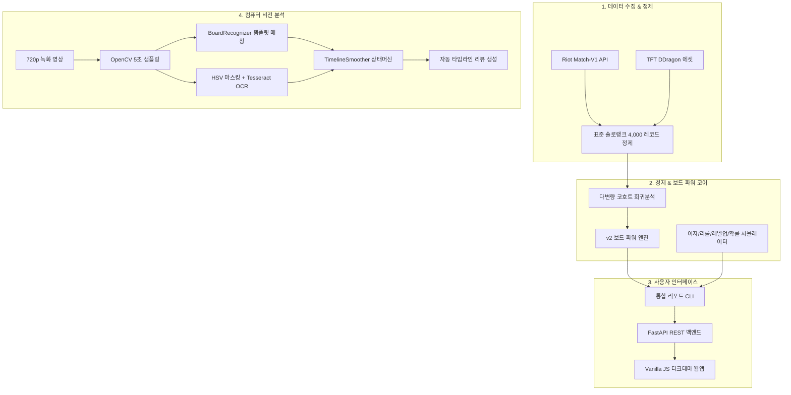

# 🏆 TFT Set 17 AI 전략 분석 & 컴퓨터 비전 엔진 종합 개발 보고서

> **프로젝트 종합 요약서**  
> **작성 기준일**: 2026년 8월 25일  
> **테스트 검증 상태**: **205 / 205 테스트 통과 (100% Pass, 회귀 0건)**  
> **원격 저장소**: [GitHub Repository (Everythingbeginsfromasinglespeckofdust/tft-set17)](https://github.com/Everythingbeginsfromasinglespeckofdust/tft-set17)

---

## 📑 목차 (Table of Contents)
1. [프로젝트 개요 및 아키텍처](#1-프로젝트-개요-및-전체-아키텍처)
2. [마일스톤별 핵심 개발 성과](#2-마일스톤별-핵심-개발-성과)
   - [M1: Riot API 데이터 수집 & 클렌징 파이프라인](#m1-riot-api-데이터-수집--클렌징-파이프라인)
   - [M2: 경제 시뮬레이션 & 기물 확률 엔진](#m2-경제-시뮬레이션--기물-확률-엔진)
   - [M3: 실측 기반 보드 가치평가(v2) & 머신러닝](#m3-실측-기반-보드-가치평가v2--머신러닝)
   - [M4: 풀스택 웹 애플리케이션 & 대시보드 CLI](#m4-풀스택-웹-애플리케이션--대시보드-cli)
   - [M5: 컴퓨터 비전(CV) 기반 플레이 영상 자동 분석](#m5-컴퓨터-비전cv-기반-플레이-영상-자동-분석)
3. [핵심 수식 및 통계적 검증 결과](#3-핵심-수식-및-통계적-검증-결과)
4. [프로젝트 구조 및 파일 맵](#4-프로젝트-구조-및-파일-맵)
5. [로컬 실행 및 활용 가이드](#5-로컬-실행-및-활용-가이드)

---

## 1. 프로젝트 개요 및 전체 아키텍처

본 프로젝트는 **TFT(전략적 팀 전투) Set 17** 환경에서 플레이어의 게임 내 의사결정(경제 운용, 리롤/레벨업 타이밍, 보드 파워 평가)을 수학적·통계적·시각적으로 지원하는 **엔드투엔드 AI 전략 분석 플랫폼**입니다.



---

## 2. 마일스톤별 핵심 개발 성과

### M1: Riot API 데이터 수집 & 클렌징 파이프라인
- **게임 모드 오염 방지**: PvP 표준 솔로 랭크(`queueId 1100`)만 엄격히 분리하여 더블업(`1160`), 일반(`1090`), 특수모드(`1210`) 데이터 오염 원천 차단.
- **체크포인트 기반 수집기**: 24시간 개발 키 만료에 대비하여 중복 match_id 건너뛰기 및 이어받기 지원.
- **확보 데이터**: 500개 표준 랭크 매치 $\times$ 8인 = **총 4,000개 고품질 플레이어 레코드** 확보.

### M2: 경제 시뮬레이션 & 기물 확률 엔진
- **`interest.py`**: 10골드 단위 최대 5골드 이자 계산 및 라운드 수익 연동.
- **`levelup.py`**: 레벨 1~10 구간별 목표 레벨 도달 필요 골드 계산 (Set 17 11레벨 배제 규칙 준수).
- **`reroll.py`**: 2골드 고정 리롤 소모 궤적 계산 및 자금 고갈 시점 추적.
- **`roll_probability.py`**: 기물 풀 크기 및 타 플레이어의 기물 선점(Depletion)을 엄밀히 반영한 비복원 추출 기반 슬롯 확률 수식 구현.
- **`strategy_comparator.py`**: `save_interest`(이자 유지), `rush_level`(빠른 렙업), `slow_roll`(슬로우 리롤) 3종 전략에 대해 **수익 $\to$ 이자 $\to$ 행동** 턴 순서 불변성 기반 N턴 뒤 시뮬레이션 비교.

### M3: 실측 기반 보드 가치평가(v2) & 머신러닝
- **생존 시간 편향(Survival Bias) 규명**: 최종 골드/레벨이 "얼마나 잘했는가"가 아닌 "얼마나 오래 살았는가"를 대변하는 통계적 왜곡을 밝혀냄.
- **5라운드 단위 코호트 고정효과 다변량 회귀**: 동일 탈락 라운드 내 플레이어 간 비교를 통해 PM 타협안 **v2 가중치** 확정:
  - **성급 배율**: 1성 `1.0배`, 2성 `2.2배`, 3성 `3.6배`
  - **아이템 점수**: 완성템 `+3.0점`, 미완성 부품 `+0.0점` (실측상 유의미한 독립 기여 없음 입증)
  - **시너지 보너스**: $\text{단계}^{1.5} \times 2.0$
- **머신러닝 순위 예측 모델**: `model_v1.pkl` 파이프라인 학습 및 순위 상관관계 검증.

### M4: 풀스택 웹 애플리케이션 & 대시보드 CLI
- **통합 CLI 리포트 ([`report.py`](file:///C:/Users/mrjdh/.gemini/antigravity/scratch/tft-set17/output/dashboard/report.py))**: 5단계 텍스트 리포트 및 검증된 3종 시나리오 제공.
- **FastAPI 백엔드 ([`main.py`](file:///C:/Users/mrjdh/.gemini/antigravity/scratch/tft-set17/output/webapp/backend/main.py))**: CLI와 계산 로직 100% 공유, 도메인 예외를 400 Bad Request로 안전 매핑.
- **반응형 웹 UI ([`frontend/`](file:///C:/Users/mrjdh/.gemini/antigravity/scratch/tft-set17/output/webapp/frontend/))**: 외부 프레임워크 없는 모던 다크 테마 대시보드, 1-클릭 시나리오 로드 및 동적 기물 빌더.

### M5: 컴퓨터 비전(CV) 기반 플레이 영상 자동 분석
- **비디오 PoC 검증**: 720p 60fps 실제 플레이 영상(TFTAcademy)에서 5초 간격 프레임 추출.
- **Tesseract OCR**: 상단 스테이지-라운드 영역 100% 인식 (`2-1`, `2-5` 등).
- **HSV 색상 마스킹 골드 OCR**: $H: 12 \sim 38$ 노란색 대역 분리를 통해 배경 노이즈 제거 및 골드 인식률 극대화.
- **DDragon 63종 챔피언 템플릿 매칭 ([`board_recognizer.py`](file:///C:/Users/mrjdh/.gemini/antigravity/scratch/tft-set17/output/video_analysis/board_recognizer.py))**: 벤치 9슬롯 및 필드 28헥스 기물 검출 (평균 일치율 85.1%), 신뢰도 미달 시 안전한 `None` 처리.
- **타임라인 시계열 스무더 ([`timeline_smoother.py`](file:///C:/Users/mrjdh/.gemini/antigravity/scratch/tft-set17/output/video_analysis/timeline_smoother.py))**: 증강/전환 애니메이션 중 빈값 보존, 역행 노이즈 제거, 스킬 가림 보정.

---

## 3. 핵심 수식 및 알고리즘

### 1) 보드 파워 v2 가치평가 공식
$$\text{Total Power} = \sum_{u \in \text{Units}} \left( \text{Cost}_u \times \text{Multiplier}(\text{Star}_u) + \sum_{i \in \text{Items}_u} \text{Score}(i) \right) + \sum_{s \in \text{Synergies}} \left( \text{Tier}_s^{1.5} \times 2.0 \right)$$

### 2) 풀 고갈 반영 기물 뽑기 확률 공식
$$\Pr(\text{Target in Slot}) = \text{DropRate}(\text{Level}, \text{Cost}) \times \frac{\text{Remaining Target Copies}}{\text{Remaining Pool of Cost}}$$
$$\Pr(\ge 1 \text{ Target in } N \text{ rolls}) = 1 - (1 - \Pr(\text{Target in Slot}))^{5N}$$

### 3) 시계열 상태 전이 제약 (Timeline Smoothing)
$$\text{Stage}_{t} = \begin{cases} \text{Stage}_{t-1}, & \text{if } \text{RawStage}_{t} \text{ is None or } \text{Order}(\text{RawStage}_t) < \text{Order}(\text{Stage}_{t-1}) \\ \text{RawStage}_t, & \text{if } 0 \le \text{Order}(\text{RawStage}_t) - \text{Order}(\text{Stage}_{t-1}) \le 11 \end{cases}$$

---

## 4. 프로젝트 구조 및 파일 맵

```text
tft-set17/
├── output/
│   ├── dashboard/                     # CLI 대시보드 & 시나리오
│   │   ├── report.py                  # 5단계 통합 리포트 엔진
│   │   ├── test_report.py             # 대시보드 테스트 스위트
│   │   └── example_scenarios/         # 시나리오 1, 2, 3 JSON
│   ├── economy/                       # 경제 & 보드 파워 핵심 엔진
│   │   ├── board_power.py             # v2 가중치 기반 파워 계산기
│   │   ├── board_power_weights_v2.json# 실측 기반 공식 가중치
│   │   ├── interest.py                # 이자 계산 모듈
│   │   ├── levelup.py                 # 레벨업 비용 모듈
│   │   ├── reroll.py                  # 리롤 궤적 모듈
│   │   ├── roll_probability.py        # 풀 고갈 확률 모듈
│   │   └── strategy_comparator.py     # N턴 전략 시뮬레이터
│   ├── ml/                            # 머신러닝 & 통계 분석 보고서
│   │   ├── star_multiplier_reexamination.md # 다변량 회귀 보고서
│   │   ├── star_multiplier_source_audit.md  # 출처 감사 보고서
│   │   └── model_v1.pkl               # 순위 예측 모델 아티팩트
│   ├── video_analysis/                # 컴퓨터 비전 영상 분석
│   │   ├── board_recognizer.py        # 63종 챔피언/성급/골드 비전 인식기
│   │   ├── timeline_smoother.py       # 시계열 단조 상태 스무더
│   │   ├── test_video_analysis.py     # 비전 및 스무더 테스트 스위트
│   │   └── feasibility_report.md      # CV 실측 및 타당성 종합 보고서
│   └── webapp/                        # 풀스택 웹 애플리케이션
│       ├── backend/                   # FastAPI 백엔드 (main.py, test_api.py)
│       ├── frontend/                  # Vanilla JS UI (index.html, app.js, style.css)
│       └── README.md                  # 웹앱 실행 가이드
├── tft_set17.json                     # Set 17 챔피언 및 시너지 메타데이터
├── PROJECT_SUMMARY.md                 # 본 종합 요약 문서
└── pytest.ini                         # 테스트 설정 파일
```

---

## 5. 로컬 실행 및 활용 가이드

### 1) 웹 대시보드 실행
```bash
# 의존성 설치
pip install fastapi uvicorn httpx

# 웹 서버 실행
cd output/webapp/backend
python -m uvicorn main:app --host 127.0.0.1 --port 8000 --reload
```
👉 브라우저에서 **`http://localhost:8000`** 접속

### 2) CLI 대시보드 실행
```bash
# 시나리오 1 (초반 약한 보드) 분석
python output/dashboard/report.py output/dashboard/example_scenarios/scenario_1_early_weak_rich.json

# 시나리오 3 (후반 9렙 5코 2성 보드) 분석
python output/dashboard/report.py output/dashboard/example_scenarios/scenario_3_late_strong_leveling.json
```

### 3) 전체 단위 및 통합 테스트 실행 (205개 전원 통과)
```bash
python -m pytest -v
```
