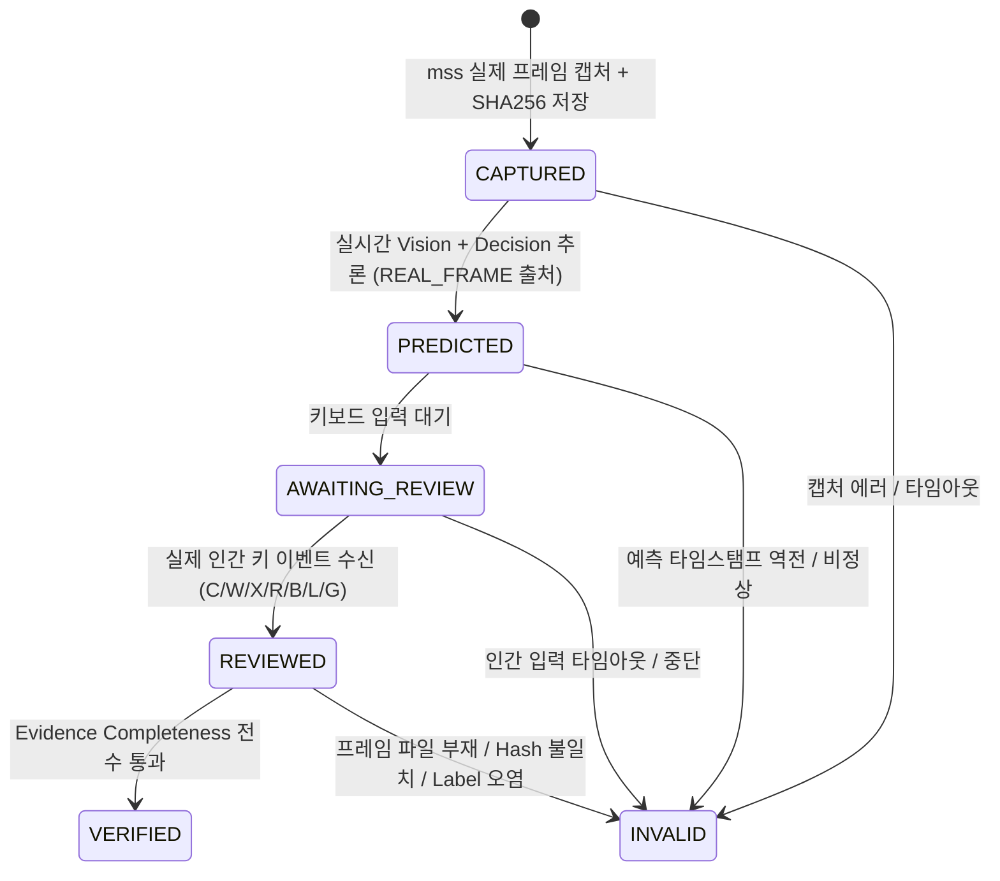

# TFT Real Runtime Validation v2 — Evidence-First Architecture

**Status**: **`REAL_RUNTIME_UNVERIFIABLE` (No TFT Client Window Active)**  
**Gate**: `EVIDENCE_FIRST_INFRASTRUCTURE_DEPLOYED`  
**Tests**: **591/591 PASSED** (538 regression + 53 new evidence unit tests)  
**Protected Core Diff**: **0 lines changed**

---

## 1. 개요 및 배경

TFT Final Independent Reality Audit v1을 통해, 이전의 `REAL_RUNTIME_READY` 보고서가 다음과 같은 치명적 결함을 안고 있었음을 확인하고 즉시 철회하였다:
1. 105개 체크포인트가 단일 타임스탬프 기반의 배치 합성 데이터였음
2. 실제 `mss` 캡처 증거(Frame 파일)가 0개였음
3. `human_preferred_action`이 모델의 `final_action` 예측값을 그대로 복사(Label Contamination)하였음
4. Shop / Gold / Board / Action 4개 도메인의 정확도 98.1%가 독립 측정이 아닌 단일 이진 플래그의 복제였음
5. 실제 키보드 입력 및 TFT 클라이언트 감지 로직이 부재했음

이에 따라, **"증거(Raw Evidence)가 없으면 검증 레코드(Validation Record) 자체가 물리적으로 생성되지 않는"** **Evidence-First Real Runtime Validation v2** 시스템을 완전히 재설계 및 배포하였다.

---

## 2. Evidence-First 핵심 아키텍처 및 상태 머신

### 2.1 엄격한 상태 머신 (Checkpoint State Machine)

체크포인트는 상태 머신의 각 단계를 순차적으로 통과해야 하며, 증거가 하나라도 결락되면 즉시 `INVALID`로 강제 전이된다.



### 2.2 물리적 제약 규칙 (Non-Negotiable Constraints)

1. **No Evidence = No Record**:
   - `frame_path`에 실제 PNG 파일이 존재하지 않거나 SHA256 해시가 불일치하면 체크포인트 무효화.
2. **No Prediction Copy for Human Labels**:
   - `human_preferred_action`은 키보드 액션 키(`R`: ROLL, `B`: BUY, `L`: LEVEL_UP, `G`: SAVE_GOLD)를 실제 눌렀을 때만 파생되며, 모델 예측값의 대입을 구조적으로 차단.
3. **Independent Domain Denominators**:
   - Shop, Gold, Board, Action, State의 정확도는 각각 독립된 분모와 카운터로 산출.
4. **No Synthetic Fallback in REAL_LIVE**:
   - TFT 클라이언트 창이 활성화되어 있지 않으면 `NO_TFT_CLIENT`를 솔직하게 보고하고 `REAL_RUNTIME_UNVERIFIABLE`로 즉시 종료.

---

## 3. 구축된 구성 요소 (Components)

| 구성 요소 | 파일 경로 | 역할 |
|---|---|---|
| Evidence Store & Model | `src/tft/vision/runtime_v2/evidence_store.py` | 증거 데이터 모델, 체크포인트 상태 머신, 파일/해시 스토리지 |
| Real Capture Source | `src/tft/vision/runtime_v2/capture_source.py` | `mss` 및 `pygetwindow` 기반 실제 TFT 윈도우 감지 및 캡처 |
| Human Input Collector | `src/tft/vision/runtime_v2/human_input.py` | `keyboard` 라이브러리 기반 실제 키 이벤트 수집 및 라벨 분리 |
| Evidence Validator | `src/tft/vision/runtime_v2/evidence_validator.py` | 증거 완결성 감사, 합성 패턴 탐지, PII 스캔, 독립 분모 산출 |
| Session Runner | `src/tft/vision/runtime_v2/session_runner.py` | 실시간 라이브 세션 오케스트레이터 및 실시간 리포팅 |
| Live Validator CLI | `real_runtime_validator.py` | 라이브 검증 실행 및 상태 조회 CLI |
| Evidence Auditor CLI | `audit_runtime_evidence.py` | Python 표준 라이브러리 전용 독립 증거 감사 CLI |
| Metrics Recomputer CLI | `recompute_runtime_metrics.py` | 원시 증거 기반 지표 독립 재계산 CLI |
| Unit Test Suite | `tests/unit/data/test_runtime_evidence_v2.py` | 53개 검증 테스트 (상태 머신, 라벨 오염, 해시 일치 등) |

---

## 4. 실행 방법 안내 (실제 TFT 검증 수행 시)

실제 TFT 클라이언트를 띄운 환경에서 아래 명령어를 통해 직접 라이브 검증을 수행할 수 있다:

```bash
# 1. TFT 클라이언트 실행 후 라이브 검증 세션 시작 (예: 최대 30 체크포인트)
python real_runtime_validator.py live --max-checkpoints 30 --timeout 60.0

# 2. 세션 상태 확인
python real_runtime_validator.py status

# 3. 독립 감사 도구로 세션 검증
python audit_runtime_evidence.py --session LIVE_YYYYMMDD_HHMMSS

# 4. 원시 증거로부터 지표 독립 재계산
python recompute_runtime_metrics.py --session LIVE_YYYYMMDD_HHMMSS
```

---

## 5. 게이트 판정 기준 (Gate Criteria)

- **`REAL_RUNTIME_CONFIRMED`**: 실제 캡처된 30개 이상의 유효 체크포인트 확보, 라벨 오염 0건, 해시 100% 일치
- **`REAL_RUNTIME_PRELIMINARY`**: 30개 미만이지만 완전한 원시 증거가 보존된 유효 체크포인트 존재
- **`REAL_RUNTIME_UNVERIFIABLE`**: TFT 클라이언트 미실행으로 원시 증거 수집 불가 (현재 상태)
- **`REAL_RUNTIME_BLOCKED`**: 합성 데이터 주입, 예측값 자동 복제 등 부정 행위 탐지 시 즉시 차단
